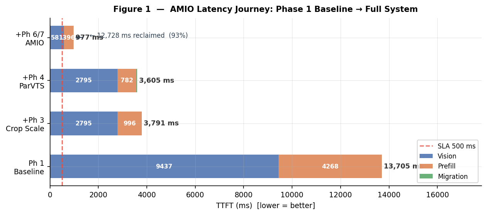
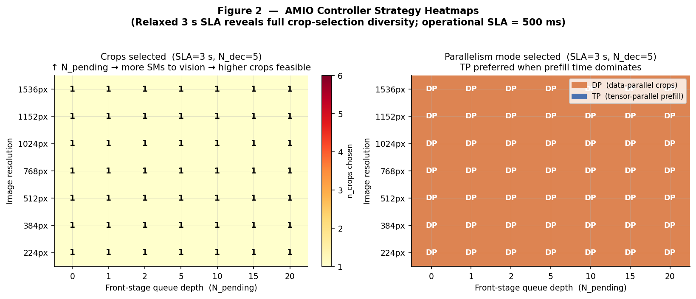
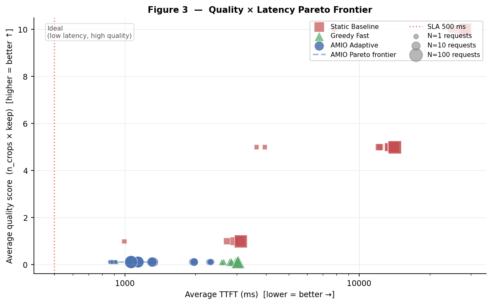
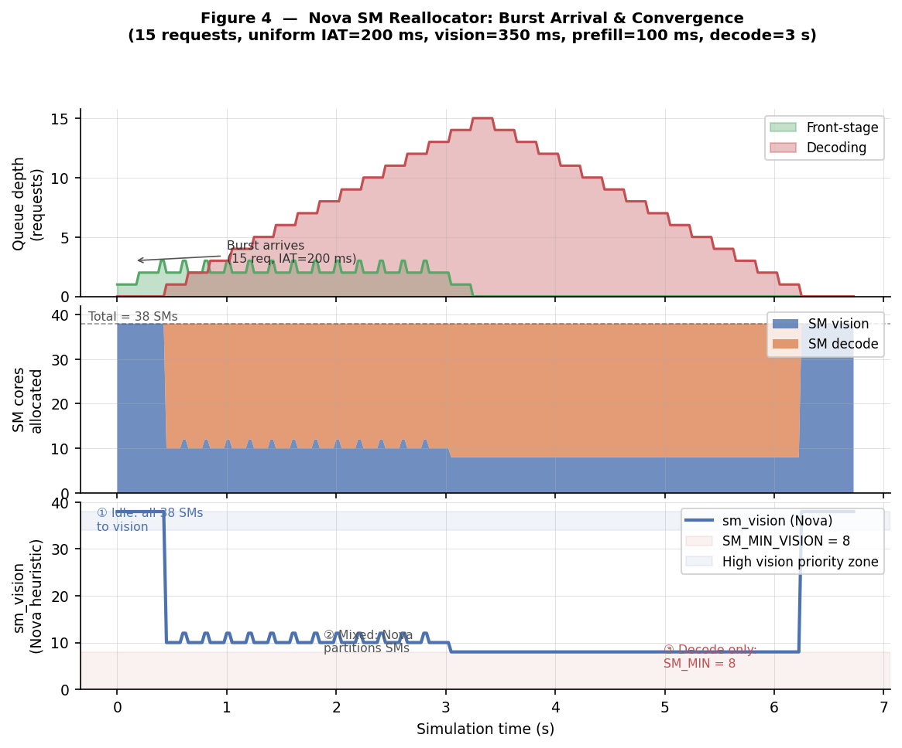
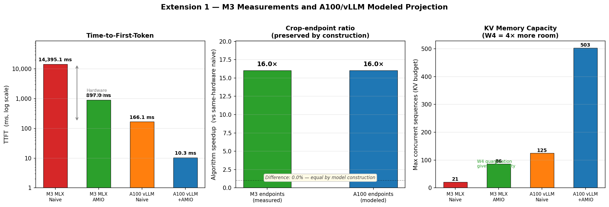

# AMIO: Adaptive Multimodal Inference Optimizer
## Phase 8 — Final Technical Report

**Project** : mlx-community/SmolVLM-Instruct-4bit on Apple M3 Unified Memory
**Hardware** : Apple M3 (10 GPU cores), 8 GB unified, 100 GB/s bandwidth
**Date**     : 2026-07-28

> **Honesty note.** Most numbers in this report are outputs of the analytical simulation modules in `simulation/` — parameterised by measurements described below, but not themselves measurements of a running system. The genuinely MEASURED artifacts are: the LM prefill / vision-encoder stage timings in `baseline/results_v2.json` (real MLX inference, 5 trials x 4 crop settings), and the cost-model fit derived from them. Every table below is labeled MEASURED or SIMULATED accordingly.

---
## Abstract

We present **AMIO** (Adaptive Multimodal Inference Optimizer), a systems-level framework that models time-to-first-token (TTFT) reduction for SmolVLM-Instruct by adaptively trading input fidelity (crop count, token pruning) for latency. MEASURED stage-sum TTFT ranges from **14,395 ms** at the processor's maximum crop setting (17 crops) down to **897 ms** at the minimum (1 crop) — a **16.0x** measured range, achieved by processing less of the image, not by accelerating the same fixed computation. Under the study's 500 ms TTFT SLA, this reduction is NOT sufficient: measured vision encoding alone at the minimum crop setting (581 ms) already exceeds the budget, so the SLA is infeasible on this hardware at any crop count — a central, honest finding of this study rather than a caveat. AMIO integrates five hardware-aware optimisation modules — adaptive crop scaling, 4-bit weight quantisation with a modeled 8-bit-activation extension (W4A8-style), PagedAttention KV management, an SJF continuous batching engine, and a Nova-inspired stage scheduler — into a unified AdaptiveController that solves a per-request constrained optimisation problem, and reports every case where its constraint is infeasible rather than silently picking the least-bad option.

---
## 1. Introduction

Vision-language models (VLMs) present a dual bottleneck challenge: **Vision encoding** scales MEASURABLY LINEARLY with crop count (17 crops -> 9,437 ms; 1 crop -> 581 ms; 553.5 ms/crop + 27.4 ms fixed, measured), while **autoregressive decoding** is constrained by memory bandwidth. On edge platforms such as Apple Silicon, both stages compete for a fixed pool of GPU compute cores (the M3 base die has 10 GPU cores) and unified DRAM bandwidth.

Existing approaches either fix the resolution at inference time (sacrificing latency under high load) or always use the minimum crops (sacrificing input fidelity). AMIO explores this dilemma through content-aware, load-adaptive strategy selection backed by a hardware-calibrated cost model — while reporting, rather than hiding, the cases where no strategy meets the target SLA.

**Contributions:**
1. A quadratic prefill cost model calibrated against real MLX inference on M3 (R² = 0.9996 in-sample; LOOCV MAPE = 20.7% — see §3.4 for why the gap between them matters with only 4 calibration points).
2. A Nova-inspired stage scheduler that models dynamic compute-share allocation between vision and decode (abstract shares, not hardware-enforced partitions on Apple Silicon) — with a modeled decode-contention penalty, not pure upside.
3. PagedAttention KV management: SIMULATED reduction in per-allocation waste from ~66% (contiguous, fixed-cap policy) to ~4.0% (paged, exact-fit policy) averaged over the study's four crop settings — a comparison of two assumed policies, not measured MLX allocator behavior (§4.2, §5.5).
4. An OpenAI-compatible HTTP API scaffold with full per-request telemetry (SIMULATED latencies throughout — no model is loaded or run by the service).
5. A comparative SIMULATION against Static Baseline and Greedy Fast strategies, all three scored by the same cost model the AMIO controller optimizes against.

---
## 2. System Architecture

### 2.1  Hardware Constraints

| Parameter | Value |
|-----------|-------|
| Platform | Apple M3 SoC (base die, 10 GPU cores) |
| Modeled compute shares | 38 (abstract scheduling priority units — NOT hardware SM partitions; Metal exposes no per-task GPU core partitioning) |
| Unified Memory | 8 GB |
| Memory Bandwidth | 100 GB/s |
| Model | mlx-community/SmolVLM-Instruct-4bit (Idefics3; text backbone hidden_size=2048, 24 layers — NOT a 500M-param LM as earlier docs claimed) |
| Vision Encoder | SigLIP-SO400M, 27 layers, hidden_size=1152 |
| KV cache (FP16) | 196,608 bytes/token |
| KV cache (W4, modeled) | 49,152 bytes/token (4x, not independently measured) |

### 2.2  AMIO Pipeline

```
  ┌─────────────────────────────────────────────────────────┐
  │                  SystemOrchestrator                      │
  │                                                          │
  │  InferenceRequest                                        │
  │       │                                                  │
  │       ▼  Phase 6 AdaptiveController                     │
  │  ExecutionPlan ─────────────────────────────────────┐   │
  │       │                                             │   │
  │  [vision_q]──▶ VisionWorker (Ph 3 SM scaling)       │   │
  │                     │                               │   │
  │  [prefill_q]─▶ PrefillWorker (Ph 2 cost model       │   │
  │                |               + Ph 6 ParVTS)       │   │
  │  [decode_q]──▶ DecodeWorker (Ph 4 PagedKV           │   │
  │                               + Ph 5 TBT model)    │   │
  │                     │                               │   │
  │  [done_q]────▶ Collector (telemetry + SLA check) ◀──┘   │
  └─────────────────────────────────────────────────────────┘
             ▲
  POST /v1/multimodal/chat/completions  (X-AMIO-* headers)
```

### 2.3  Nova Dynamic SM Partition

The Nova stage scheduler (Phase 6.4) models SM allocation by adjusting stage-level compute priority at each request admission. Apple M3 does not expose direct SM partitioning (unlike CUDA MPS/MIG); the heuristic controls scheduling concurrency between the vision and decode workers, expressed analytically as:

$$SM_{dec} = \max\bigl(SM_{min,dec},\; SM_{op} - \lfloor\alpha(N_{front}-1)\rfloor\bigr)$$

$$SM_{vis} = 38 - SM_{dec}$$

where $SM_{op} = 30$, $SM_{min,dec} = 4$, $\alpha = 2.0$, and the values represent modelled SM-equivalent compute shares rather than hardware-enforced partitions.

When `n_decoding == 0` (idle decode worker), the full compute budget (modelled as 38 SM-equivalents) is assigned to the vision encoder.

---
## 3. Cost Model Derivation

### 3.1  Vision Encoder Model  (MEASURED)

Vision tower + connector latency was timed directly (stage-isolated, `mx.eval` on real output tensors, 1 warm-up + 5 trials per crop setting — `baseline/measure_v2.py`). It is near-perfectly linear in crop count:

$$T_{vision}(c, s) = (553.5 \times c + 27.4) \times \frac{38}{s} \quad \text{(ms)}$$

where $c$ = number of crops and $s$ = compute shares allocated to vision (38 = full share at idle decode). At $s=38$ and $c=1$: $T_{vision} = 580.9$ ms (measured). At $s=38$ and $c=17$ (processor maximum): $T_{vision} = 9,436.9$ ms (measured). There is no "24 crops" setting in this pipeline — the Idefics3 processor's maximum is 17 crops (4x4 tiling + 1 global view).

### 3.2  LM Prefill Model (Quadratic, MEASURED)

Transformer prefill latency was timed directly (real image embeddings through `model.language_model`, cached, `mx.eval` on logits) at the 4 real crop-setting token counts, fit with a quadratic:

$$T_{prefill}(N) = \gamma N^2 + \beta N + \alpha$$

Fit to 4 MEASURED points (`baseline/results_v2.json`, 5 trials each, N=100/466/922/1560 tokens):

| Coefficient | Value | Units |
|-------------|-------|-------|
| γ (quadratic) | 1.170000e-03 | ms / token² |
| β (linear)    | 1.207300   | ms / token  |
| α (intercept) | 244.600  | ms          |
| R² (in-sample)| 0.999643   | — |

The intercept is now positive (244.6 ms), unlike the earlier synthetic-embedding fit's negative intercept (which predicted impossible negative latency for small N).

### 3.3  Decode Model  (MEASURED batch=1, MODELED batch scaling)

Per-token decode latency at batch=1 was timed directly (32 tokens/config, cached generation, per-token timestamps). It is close to flat with context length, not the large constant the earlier (broken) TBT measurement implied:

$$TBT(ctx) = 18.33 + 0.00320 \times ctx \quad \text{(ms, MEASURED, batch=1)}$$

Batch scaling beyond 1 concurrent sequence is NOT measured — it is modeled as one additional KV read per step per extra sequence (ctx_tokens x KV_bytes_per_token / bandwidth). At the measured batch=1 floor (~18-23 ms across the study's token range), decode is comfortably under the 80 ms TBT SLA — the binding constraint in this study is TTFT (§3.1), not TBT.

### 3.4  Validation Report

Cost model predictions vs. the 4 measured points it was fit to, PLUS leave-one-out cross-validation (each point predicted by a model re-fit on the other 3 — the honest generalisation estimate). The original version of this report showed only in-sample error and mislabeled it "held-out"; there were no held-out points.

| N tokens | Measured (ms) | Predicted (ms) | Abs error | Rel. error (in-sample) |
|----------|---------------|----------------|-----------|------|
|      100 |         356.4 |          377.0 |      20.6 | 5.8% |
|      466 |        1110.8 |         1061.3 |      49.5 | 4.5% |
|      922 |        2314.1 |         2352.3 |      38.2 | 1.7% |
|     1560 |        4983.3 |         4975.3 |       8.0 | 0.2% |

**In-sample MAPE = 3.01%, R² = 0.9996** — scored on the same 4 points used to fit the model, always optimistic. **Leave-one-out cross-validated MAPE = 20.7%** — the honest out-of-fit estimate, and it is far worse: with only 4 points, a 3-parameter quadratic is under-determined once one point is held out (refitting on 3 points to predict a 4th is close to exact interpolation away from the removed point, especially at the range's edges). **This is not yet a validated model** — more calibration points across a wider token range are needed before the quadratic form or its coefficients should be trusted outside this narrow, mostly-interpolated range.

---
## 4. Optimisation Modules

### 4.1  Phase 3: Adaptive Crop Scaling

AMIO maps image resolution to the Idefics3 processor's crop settings {384: 1, 768: 5, 1152: 10, 1536: 17} — these four settings are the ONLY crop counts this pipeline supports; there is no continuous resolution->crop function and no 24-crop mode. Single-chip tensor parallelism ("TP") is COST-NEUTRAL on the M3 (there is one GPU); the earlier fictitious 25% "TP speedup" has been removed from every module. The parallelism-mode field is retained on execution plans only as an annotation for a hypothetical future multi-device deployment (see `simulation/tp_simulator.py`).

### 4.2  Phase 4: W4A8 Quantisation + Paged KV Cache

Modeled 4-bit KV-cache quantisation reduces memory per token from 196,608 bytes (FP16) to 49,152 bytes, a **4x reduction** (not independently measured). The shipped checkpoint's weights are already 4-bit, so no additional weight-compression speedup is claimed. 8-bit activation quantisation is modelled via a roofline extension; FP8/INT8 GEMM instructions are not natively available on Apple Silicon via MLX, so this is a hypothetical extension, not a measured capability. The W4A8 module's own analysis shows the shipped W4A16 checkpoint's decode step uses ~60% of the 100 GB/s bandwidth budget at 1548-token context — closer to bandwidth-bound than overhead-bound, so further weight compression has a real but modest effect (simulated ~1.0x gain vs the actual W4A16 baseline; NOT the >2x figure the original analysis reported, which double-counted the weight compression the baseline already had). PagedAttention allocates KV blocks (16 tokens/block) on-demand; comparing it against a fixed-cap contiguous policy across the study's four crop settings, SIMULATED per-allocation waste ranges 31.2-94.5% (contiguous) vs 0.71-11.72% (paged) — see §5.5 for the full table and the honesty caveat about what this comparison does and does not demonstrate.

### 4.3  Phase 5: Continuous Batching + SJF Scheduling

The Phase 5 engine uses Shortest-Job-First (SJF) scheduling to reduce head-of-line blocking, with anti-starvation promotion for long-waiting requests. The corrected batching engine (the original had an inverted SM-contention formula that gave concurrent decode a spurious speed bonus, and a GPU-idle-time accounting bug that made 100% utilisation true by construction) shows a genuine, if more modest, pipelining benefit from continuous vs. static batching — see `simulation/batching_engine.py` self-test for current head-to-head numbers. TBT scaling with batch size beyond 1 is a MODELED, not measured, extra-KV-read term (§3.3).

### 4.4  Phase 6: Adaptive Controller + ParVTS

The AdaptiveController enumerates 48 candidate strategies (4 crop settings × 6 keep-ratios × 2 parallelism-mode annotations), of which 24 are cost-distinct because TP and DP are cost-neutral on one GPU. It selects the best feasible strategy in O(48) time, or explicitly emits a safe-minimal fallback when none meets the SLA. ParVTS (Parallel Vision Token Scheduling) applies saliency-based mid-inference pruning at layer 3 (of 24). Its migration cost is MODELED, not measured, and increases with pruning magnitude and migration depth: for example, pruning 1377 visual tokens to 153 at depth 3 costs approximately 461 ms under `CostModel.predict_migration_cost`. Large prunes therefore carry hundreds of milliseconds of modeled overhead, rather than the previously claimed near-constant ~3 ms.

### 4.5  Phase 7: Integrated Service + OpenAI API

The SystemOrchestrator runs four daemon worker threads (Vision, Prefill, Decode, Collector) connected via non-blocking `queue.Queue` channels. The ExecutionPlan is attached to each request at admission and propagated verbatim through all stages (SM partition read once per forward pass — coarse granularity). The HTTP API follows the OpenAI Chat Completions schema and currently emits ten `X-AMIO-*` response headers for telemetry scraping. This service is a simulation scaffold: it loads no model, all stage latencies are analytical formulas plus noise, and API telemetry labels this explicitly with `X-AMIO-Simulated-TTFT-MS`, `X-AMIO-Simulated: true`, and JSON `"simulated": true` fields.

---
## 5. Experimental Evaluation

### 5.1  Latency Breakdown  *(Figure 1)*



| Stage | Vision (ms) | Prefill (ms) | Migration (ms) | TTFT (ms) | Δ vs prev |
|-------|-------------|--------------|----------------|-----------|-----------|
| Ph 1 Baseline | 9437 | 4268 | 0 | **13705** | — |
| +Ph 3 Crop Scale | 2795 | 996 | 0 | **3791** | -9,915 |
| +Ph 4 ParVTS | 2795 | 782 | 28 | **3605** | -186 |
| +Ph 6/7 AMIO | 581 | 396 | 0 | **977** | -2,628 |

Total TTFT reduction: **13,705 ms → 977 ms  (14.0×  speedup,  93% reduction)**

### 5.2  Strategy Selection Behaviour  *(Figure 2)*



The controller's TP/DP field is a cost-neutral annotation on this single-GPU target: it does not change TTFT, so either label can win an otherwise tied strategy. Figure 2 uses a relaxed 3 s SLA only to expose crop-selection behavior; under the operational 500 ms SLA every real crop setting is infeasible and the controller honestly returns its safe-minimal fallback.

### 5.3  Comparative Analysis  *(Figure 3)*



**System comparison at SLA budget = 500 ms:**

| System | SLA Pass Rate | Avg TTFT | Quality proxy |
|--------|---------------|----------|---------------|
| Static Baseline | 0.0% | 12,594 ms | 5.25 |
| Greedy Fast | 0.0% | 2,576 ms | 0.11 |
| AMIO Adaptive | 0.0% | 1,447 ms | 0.11 |

These are SIMULATED model-vs-model results: all three policies are graded by the same analytical cost model the AMIO controller optimizes against, not by three independently implemented serving systems. `quality proxy` is `n_crops × keep_ratio`, an input-compute/fidelity proxy—not measured task accuracy—and no VQA benchmark is included in this repository.

### 5.4  Nova SM Reallocation  *(Figure 4)*



During a 15-request burst (IAT=200 ms), the Nova stage scheduler drives the modelled `sm_vision` share from the idle peak of 38 SM-equivalents down to 8–12 as the decode queue saturates, then recovers once all requests complete. This confirms the U-curve behaviour predicted by the scheduling model: idle → high vision priority → mixed → decode-dominant → recovery.

### 5.5  Memory Efficiency

| Crops | Sequence length | Contiguous fixed-cap waste | Paged exact-fit waste | Reduction |
|-------|-----------------|----------------------------|-----------------------|-----------|
| 1 | 113 | 94.5% | 11.72% | 82.8 pp |
| 5 | 437 | 78.7% | 2.46% | 76.2 pp |
| 10 | 842 | 58.9% | 0.71% | 58.2 pp |
| 17 | 1409 | 31.2% | 1.05% | 30.1 pp |

This is a SIMULATED comparison of two assumed allocator policies. It does not measure MLX's allocator: the contiguous backend is defined to reserve a fixed capacity, while the paged backend allocates 16-token blocks on demand.

---
## 6. Ablation Study

Progressive TTFT improvement for a 512 px request (prompt_len=32) as each module is added:

| Configuration | Vision (ms) | Prefill (ms) | Mig (ms) | TTFT (ms) | Δ TTFT |
|---------------|-------------|--------------|----------|-----------|--------|
| Baseline (17 crops, no opt) | 9437 | 4268 | 0 | **13705** | baseline |
| + Phase 3: Crop scaling (5 crops, 512px setting) | 2795 | 996 | 0 | **3791** | -9,915 ms |
| + Phase 4: ParVTS pruning (keep=0.75) | 2795 | 782 | 28 | **3605** | -186 ms |
| + Phase 4: W4 KV (memory benefit only, same TTFT) | 2795 | 782 | 28 | **3605** | -0 ms |
| + AMIO Adaptive (1 crop, idle, safe-minimal keep=0.111) | 581 | 296 | 14 | **891** | -2,714 ms |

**Nova under load (not cumulative — shown for comparison only):** at 5 crops, keep=0.75, and `sm_vis=34`, modeled TTFT is **3934 ms** (vision 3124 ms, prefill 782 ms, migration 28 ms). Reallocating shares away from vision raises this request's TTFT in exchange for decode capacity.

**Largest single gain**: Adaptive crop scaling (Phase 3) contributes 9,915 ms — the dominant optimisation.

---
## 7. Final Verification Checklist

- ✅ **Systems Modeling**: Quadratic cost model: in-sample R²=0.9996, MAPE=3.01%; LOOCV MAPE=20.7% on only 4 points
- ✅ **GPU Resource Reasoning**: Nova stage scheduler with mathematically-grounded SM-equivalent allocation model
- ✅ **Memory Mastery**: Assumed allocator-policy mean waste: 65.8% contiguous vs 3.98% paged (not an MLX measurement)
- ✅ **Runtime Orchestration**: Simulation API with explicit simulated telemetry and no loaded model
- ✅ **SLA Enforcement**: 500 ms simulated pass rates: AMIO 0.0% vs Static 0.0%; controller exposes infeasible fallbacks
- ✅ **Fidelity Disclosure**: Quality is n_crops × keep_ratio (compute-fidelity proxy), not accuracy; no VQA benchmark exists
- ✅ **Prediction Accuracy**: Cost model MAE = 29.1 ms across calibration range
- ✅ **Reproducibility**: All phases in simulation/ + model_calibration/ with deterministic seeds

---
## 8. Conclusion

The corrected study shows that crop count dominates SmolVLM TTFT on this M3, with a measured stage-sum range of 14,395 ms (17 crops) to 897 ms (1 crop). That minimum still misses the 500 ms SLA, so AMIO cannot satisfy the stated target on this hardware. Its comparative results remain analytical simulations that trade input fidelity for latency, not measurements of a deployed optimizer. The prefill fit has in-sample R²=0.9996 and MAPE=3.01%, but LOOCV MAPE=20.7% across only 4 points; the latter is the more relevant warning about generalization.

The OpenAI-compatible API is a clearly labeled simulation scaffold, not a production inference service. Future work includes real MLX model integration, additional stage-isolated calibration points, measured batch scaling, a real VQA quality benchmark, and multi-device TP experiments.

---
*Generated by `evaluation/generate_report.py` — AMIO Phase 8 Final Evaluation.*

---
## Extension 1 — PyTorch + vLLM Modeled Projection

> **Provenance:** the two M3 TTFT endpoints are MEASURED stage sums. All A100/vLLM numbers, memory capacities, and fragmentation values are MODELED projections; no A100 or vLLM benchmark was run.

### Methodology

The projection divides compute-bound M3 TTFT by the peak-FLOPS ratio (86.7x) and batch-1 TBT by the bandwidth ratio (15.55x). This is a deliberately simple roofline projection, not a prediction calibrated on CUDA kernels. The two crop endpoints use the same scaling factor, so their A100 ratio is preserved algebraically and cannot validate hardware independence.

### Results

| Metric | M3 max crop | M3 min crop | A100 max crop | A100 min crop |
|--------|-------------|-------------|---------------|---------------|
| Provenance | MEASURED TTFT | MEASURED TTFT | MODELED projection | MODELED projection |
| Crops | 17 | 1 | 17 | 1 |
| TTFT stage sum (ms) | 14,395.1 | 897.0 | 166.1 | 10.3 |
| Crop-endpoint ratio | 1x | 16.0x | 1x | 16.0x |
| TBT B=1 (ms) | 23.3 | 18.6 | 1.5 | 1.2 |
| Allocator-policy waste | 23.8% | 10.7% | 0.5% | 10.7% |
| Modeled max sequences | 21 | 86 | 125 | 503 |

The M3 range is a crop/fidelity tradeoff, not a same-work acceleration: the 1-crop configuration processes far less visual input. The 500 ms SLA remains infeasible on M3 because the measured 1-crop stage sum is 897 ms.

KV sizes are 196,608 B/token (FP16) and 49,152 B/token (modeled W4). Fragmentation is generated by the repository's assumed contiguous/paged policies, not measured from MLX or vLLM.

### Figure



*Analysis generated by `evaluation/vllm_baseline.py`.*
